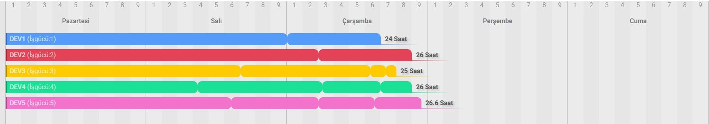

# ToDoList Case Çalışması

Provider entitysi ile veritabanı tablosu oluşturulduktan sonra "app:fetch-tasks" ile command çalıştırılarak servislerden gelen verileri tabloya yazınız.
Proje serve edildikten sonra /workList yoluna gidiniz.

Örnek çıktı:

